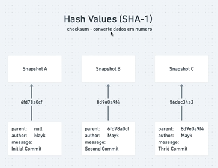
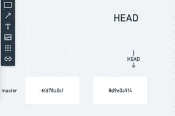

# **<center><font size="10" color="lightblue">GIT</font></center>**

## <font size="6" color="orange">**Controle de versão**</font>

* ### Registro de alterações em um ou mais arquivos

* ### Lembrar versões específicas mais tarde

* ### Reverter para estado anterior ou um projeto inteiro

* ### Compare as mudanças ao longo do tempo

* ### Veja quem modificou pela última vez em algo que pode estar causando um problema

* ### Recuperação de arquivos estragados ou perdidos

### **<font color="orange">| VCS - Version Control System</font>**

***

## <font size="6" color="orange">**📢 Tipos de Controle de Versão**</font>

## 1. **Sistemas Locais**

* ### Copiar os arquivos para outro diretório manualmente

* ### Muito comum e simples

* ### Incrivelmente propensa a erros

* ### Fácil de sobrescrever arquivos, caso tenha feito uma cópia errada

    ***

## 2. **Sistemas Centralizados**

* ### Um único servidor, que contém todos os arquivos de controle de versão

* ### Vários clientes usam arquivos a partir deste lugar central

    ***

## 3. **Sistemas Distribuídos**

### Exemplo: Git

* ### Duplicar (clonar) localmente o repositório completo

* ### Se qualquer servidor morrer, e esses sistemas estiverem colaborando por meio dele, qualquer um dos repositórios do cliente poderá ser copiado de volta para o servidor

* ### Cada clone é de fato um backup completo de todos os dados

* ### Clientes usam o estado mais recente dos arquivos

***

## <font size="6" color="orange">**📢 O que é o GIT?**</font>

* ## Sistema de controle de versão distribuído

* ## Open-source

* ## Pontos na história: (viagem no tempo)

    * ### Histórico de alterações no código

    * ### Voltar para qualquer ponto na história do código

* ## Controlar o fluxo de novas funcionalidades

    * ### Ramificações: branch (universos paralelos)

    * ### Vários devs no mesmo projeto

    * ### Análise e resolução de conflitos

***

## <font color="orange">[**git config**]</font>

* ### Permite ver e atribuir variáveis de configuração como nome e email.

* ### Estas variáveis podem ser armazenadas em três lugares diferentes:

    * ### <kbd><font color="cyan">/etc/gitconfig</font></kbd>: válido para todos os usuários no sistema e todos os seus repositórios. Se você passar a opção <kbd><font color="cyan">--system</font></kbd> para <kbd><font color="cyan">git config</font></kbd>, ele lê e escreve neste arquivo

    * ### <kbd><font color="cyan">~/.gitconfig</font></kbd> ou <kbd><font color="cyan">~/.config/git/config</font></kbd>: Somente para o seu usuário. Você pode fazer o Git ler e escrever neste arquivo passando a opção <kbd><font color="cyan">--global</font></kbd>

    * ### <kbd><font color="cyan">config</font></kbd> no diretório Git (ou seja, <kbd><font color="cyan">.git/config</font></kbd>) de qualquer repositório que você esteja usando: específico para este repositório

### Cada nível sobrescreve os valores no nível anterior, ou seja, valores em <kbd><font color="cyan">.git/config</font></kbd> prevalecem sobre <kbd><font color="cyan">/etc/gitconfig</font></kbd>.

### No Windows, o arquivo .gitconfig estará no diretório HOME que é C:/Users/USER

***

## <font color="orange">[**git help**]</font>

* ### Ajuda sobre os comandos mais básicos do git

* ### É possivel adicionar um comando específico para retornar ajuda sobre o mesmo 
    
    * ### Exemplo: <kbd><font color="cyan">git log</font></kbd>

        ```git
        git help log
        ```

        ### Trás informações mais detalhadas acerca do comando log

***

## <font color="orange">[**git init**]</font>

* ### Inicia um repositório local no diretório em que o terminal estiver.

* ### O repositório inicializa-se vazio

* ### A pasta <kbd><font color="cyan">.git</font></kbd> fica oculta, guardando toda a história do projeto

***

## <font color="orange">[**git add**]</font>

* ### Adicionar arquivo ao repositório local, preparando-o para **entrar na história** (commit) do projeto 

* ### Exemplo 1: adicionar "arquivo.js" ao repositório

    > ### <kbd><font color="cyan">git add arquivo.js</font></kbd>

* ### Exemplo 2: adicionar todos os arquivos do diretório atual ao repositório

   > ### <kbd><font color="cyan">git add .</font></kbd>

* ### Exemplo 3: adicionar todos os arquivos que tiverem uma extensão determinada   

    > ### <kbd><font color="cyan">git add *.md</font></kbd>

***

## <font color="orange">[**git restore --staged**]</font>

* ### Serve para remover um arquivo da staged area, ou seja, trazê-lo de volta ao Working directory e impedi-lo de ser commitado

***

## <font color="orange">[**git commit**]</font>

* ### Comando responsável por criar um ponto na linha do tempo do projeto, podendo ser reacessado no futuro

* ### Atribui os arquivos e alterações à história do projeto

* ### Replica todas as mudanças feitas desde o último commit para o repositório local

* ### Sempre vem acompanhado de uma mensagem/título

* ### **Sintaxe**:

    > **<kbd><font color="cyan">git commit -m "título/mensagem do commit aqui dentro"</font></kbd>**

***

## <font color="orange">[**git status**]</font>

* ### Mostra o estado do repositório local atual

***

## <font color="orange">[**git log**]</font>

* ### Comando que mostra a história, o registro do projeto, revelando os pontos desta história (commits) e seus autores

    > **<kbd><font color="cyan">git log"</font></kbd>**

* ### Exemplo: **git log** num diretório logo após um commit de Kaik Barreto na branch master, às 10:06 da manhã:

    ### **Saída**:

    |Author|Date|commit|
    | :-: | :-: | :-: |
    |Kaik Barreto|Fri Oct 23 10:06:58| as3125sd934dfh4iks9 |
    |<kaikchaides123@gmail.com>| -0300| (<font color="cyan">HEAD -></font> <font color="lime">master</font>) |
    
* ### É possível realizar o log de uma forma mais enxuta:

    > **<kbd><font color="cyan">git log --oneline"</font></kbd>**

    ### **Saída**:

    > as3125sd (<font color="cyan">HEAD -></font> <font color="lime">master</font>) nome_do_commit

* ### Também é possível realizar o log de uma quantidade especificada dos últimos commits

    * ### **Exemplo**: log dos últimos 5 commits

        > **<kbd><font color="cyan">git log -n 5</font></kbd>**

## **git log --since**

* ### Retorna os commits realizados **A PARTIR** de uma data especificada 

* ### **Exemplo**: commits realizados desde 10/01/2020

    > **<kbd><font color="cyan">git log --since=2020-10-01</font></kbd>**

## **git log --until**

* ### Antologicamente ao since, retorna os commits realizados **ANTES** de uma data especificada

* ### **Exemplo**: commits realizados antes de 10/01/2020

    > **<kbd><font color="cyan">git log --until=2020-10-01</font></kbd>**

## **git log --author**

* ### Permite trazer os commits realizados por um autor específico

* ### **Exemplo**: commits realizados pelo dev Kaik

    > **<kbd><font color="cyan">git log --author=Kaik</font></kbd>**

## **git log --grep**

* ### Usado para buscar commits baseado em expressões regulares

* ### **Exemplo**: trazer commit(s) cujo nome seja -- ou possua -- "bugfix"

    > **<kbd><font color="cyan">git log --grep="bugfix"</font></kbd>**

***

## <font color="orange">[**git show**]</font>

* ### É usado para imprimir no terminal as mudanças realizadas em determinado commit.

* ### **Sintaxe**:

    > ### **<kbd><font color="cyan">git show hash_do_commit</font></kbd>**

    * ### Exemplo: Mostrar as mudanças realizadas no commit cuja hash se inicia por **[abcd1234]**:

        > ### **<kbd><font color="cyan">git show abcd1234</font></kbd>**

        * ### **Saída:** Todas as mudanças realizadas neste ponto da história (commit).

    ***

    * ## Mostrar apenas as **PALAVRAS** alteradas, usando o parâmetro **[--color-words]**:

        > ### **<kbd><font color="cyan">git show --color-words</font></kbd>**

      * ### **Saída:** As palavras que foram alteradas neste ponto da história (commit).

    ***

    * ## **Mostrar apenas as alterações de um arquivo**:

        > ### **<kbd><font color="cyan">git show -- caminho_do_arquivo</font></kbd>**

        * ### **Saída:** As alterações que foram realizadas neste ponto da história (commit) apenas para o arquivo ou pasta especificado.

        * ### Pode-se selecionar as alterações de todos os arquivos de uma pasta, digitando "*" após o caminho da mesma:

            > ### **<kbd><font color="cyan">git show -- caminho_da_pasta/*</font></kbd>**

***

## **_<font size=6 color="Orange"><center>Estágios do arquivo</font>_**

* ## **Working Directory**

    * ### Onde o arquivo foi ***MODIFICADO***

* ## **Stage Area**

    * ### Onde o arquivo foi ***PREPARADO***

* ## **Local Repository**

    * ### Onde o arquivo foi ***COMMITADO***

## Fluxo:

> ## <kbd><font color="cyan">git init/clone</font></kbd> → [**Working Directory**] → <kbd><font color="cyan">git add</font> </kbd> → [**Stage Area**] → <kbd><font color="cyan">git commit</font></kbd> → [**Local Repository**]

***

# <center>**<font size=10 color="orange">Hash Values (SHA-1)</font>**

<center>


</center>

***

## <font size=6 color="orange">**HEAD**</font>

* ### É um ponteiro, que apontará em que momento da história (commit) estamos situados



*** 

## <center><font size=7 color="orange">**Alterando arquivos**</font></center>

***

## <font size=6 color="orange">**Adicionar arquivos**</font>

## **Adicionar arquivos com <kbd><font color="cyan">git add</font></kbd>**

* ### Transfere-se o arquivo para a **Stage Area**, preparando-o para ser commitado.

```bash
mkdir git-exemplo       // criar pasta
cd git-exemplo         // entrar na pasta
git init              // iniciar repositorio
touch README.md      // criar arquivo
code README.md      // abrir e editar arquivo no vscode
git add .  // adicionar todas as alterações ao repositório
```

***

## <font size=6 color="orange">**Editar arquivos**</font>

## **Modificações com <kbd><font color="cyan">git diff</font></kbd>**

  * ### É possível retornar as alterações feitas, utilizando o comando <kbd><font color="cyan">git diff</font></kbd>

  * ### Compara o conteúdo entre o Working Directory e o repositório

  ## **Modificações com <kbd><font color="cyan">git diff --staged</font></kbd>**

  * ### Compara o conteúdo entre a Staged Area e o repositório

***

## <font size=6 color="orange">**Deletar arquivos**</font>

## **Remoções com <kbd><font color="cyan">git rm</font></kbd>**

* ### Remove o arquivo especificado apos o comando **<kbd><font color="cyan">git rm</font></kbd>** e já faz o **<kbd><font color="cyan">git add</font></kbd>** para a **Stage Area**, deixando a remoção do arquivo pronta para ser commitada.

***

## <font size=6 color="orange">**Renomear arquivos**</font>

## **Reatribuições com <kbd><font color="cyan">git mv</font></kbd>**

* ### Permite mudar o nome (e, consequentemente, o caminho) de um arquivo

* ### **Sintaxe**: 

    ```bash
    git mv nome_anterior nome_novo
    ```

***

## <font size=6 color="orange">**Mover arquivos**</font>

## **Transferência de arquivos entre diretórios com <kbd><font color="cyan">git mv</font></kbd>**

* ### **Exemplo prático:**

    ```javascript
   
   
   
   
    mkdir pasta   // criando a pasta de destino

    git mv arquivo.txt pasta/arquivo.txt  // renomeando o endereço do arquivo para dentro da pasta
    ```

***

## <font size=6 color="orange">**Desfazer mudanças**</font>

* ## Desfazendo no Working Directory:

    * ### O arquivo foi alterado e ainda não foi preparado (git add) para o commit, ou seja, está no **Working Directory**

    * ### Utilizando **<kbd><font color="cyan">git restore arquivo.txt</font></kbd>**, as alterações feitas serão descartadas.

    ***

* ## Retornando da Stage Area:

    * ### O arquivo foi alterado e já foi preparado (git add) para o commit, ou seja, está na **Stage Area**

    * ### Utilizando <kbd><font color="cyan">git restore --staged arquivo.txt</font></kbd> podemos trazer o arquivo de volta para o Working Directory

      * #### Ou <kbd><font color="cyan">git restore --staged .</font></kbd> para retornar todos.

    * ### Também é possível utilizar <kbd><font color="cyan">git reset HEAD .</font></kbd> para retornar todos os arquivos da Stage Area para o Working Directory

    *** 

* ## Corrigindo **O ÚLTIMO** commit:

  * ### Usamos "--amend" para corrigir
  
    * ### **<kbd><font color="cyan">git commit --amend</font></kbd>**

* ### **Exemplo**:

    ### Fazer alterações em um commit e depois "recommitá-lo"

    > ### <kbd><font color="cyan">git commit --amend -m "nome_do_commit"</font></kbd>
    > ### *Faz as alterações* <br>
    > ### <kbd><font color="cyan">git commit --amend</font></kbd>

    * ### Resultado: o commit anterior passou a ter novas alterações nos arquivos

    ***

    * ### Também é possível mudar o nome de um commit 

        > ### <kbd><font color="cyan">git commit --amend -m "novo_nome_do_commit"</font></kbd>

        * ### Resultado: o commit anterior passou a ter um novo nome

    ***

    * ### Desta forma, é possível unir as duas técnicas e mudar tanto os arquivos de um commit, como seu nome.

***


## <font size=6 color="orange">**Recuperando arquivos**</font>

* ### **<kbd><font size=6 color="cyan">git ckeckout</font></kbd>**

    * ### Permite trazer arquivos de um determinado commit para o ambiente em que se está trabalhando

    * ### **Sintaxe**:

        > ### **<font size=4 color="cyan">git ckeckout  abcd1234 -- arquivo.txt</font>**

        * ### **Leia-se:** trazer o arquivo [arquivo.txt] para o ambiente atual [--], vindo do commit de hash [abcd1234]

***

## <font size=6 color="orange">**Removendo arquivos não rastreados**</font>

* ### **<kbd><font size=6 color="cyan">git clean</font></kbd>**

    * ### Permite remover todos os arquivos não rastreados, ou seja, que não estejam na **Stage Area**

    * ### Permanente e irreparável

    * ### **Sintaxe**:

        * ### **<kbd><font color="cyan">git clean -f</font></kbd>**

          * #### -f serve para forçar a execução do comando, uma vez que este é, como já dito, irreparável

        ***

    * ### É possível ver o que aconteceria com o comando git clean, uma espécie de prévia:

    * ### **<kbd><font color="cyan">git clean -n</font></kbd>**

    ### Saída: 

    ```bash
    git clean -n
    Would remove arquivo1.txt
    Would remove arquivo2.txt
    ```

    ### Leia-se: "Iria remover os arquivos 1 e 2."
    
***

## <font size=6 color="orange">**Revertendo um commit**</font>

* ### **<kbd><font size=6 color="cyan">git revert</font></kbd>**

    * ### Para este comando, o diretório (working tree) deve estar limpo (git status para checar)

    * ### **Sintaxe**:

        * ### **<kbd><font color="cyan">git revert HEAD~5</font></kbd>**    

        * ### **Leia-se**: reverter o commit 5 posições antes de onde está o **HEAD**

***

## <font size=6 color="orange">**Ignorando arquivos e diretórios indesejados**</font>

* ### Pode-se incluir caminho do arquivo ou diretório para que este seja ignorado pelo Git, uma vez que não seja pertinente ao projeto. 

* ### Para ignorar pastas, o ideal é colocar uma barra após seu nome, para indicar que se trata de um diretório. **<kbd><font size=5 color="cyan">"documents/git-aula/pasta/"</font></kbd>**

* ### Uma vez que um arquivo ou pasta esteja no arquivo **_.gitignore_**, este será deletado quando houverem commits.

***

# **<font size=6 color="magenta">Utilizando o git para fazer upload no repositório remoto (github)</font>**

## Passo a passo:


* ## <font color="orange">_Criando um repositório local_</font>

    <font color="cyan">

    > ### mkdir pasta_do_repositorio
    > ### cd pasta_do_repositorio  
    > ### git init
    > ### * faz as alterações *
    > ### git commit -m "nome_do_repositorio"

    </font>

    ***

* ## <font color="orange">_Linkando um repositório remoto com local_</font>

    <font color="cyan">

    > ### git remote add origin https://github.com/kaikbarreto/nome_do_projeto.git
    > ### git branch -M main
    > ### git push -u origin main

    </font>

    * ### Uma vez que estas configurações tenham sido feitas, basta digitar <kbd><font color="cyan">**git push**</font></kbd> para dar um push da branch atual para o repositório remoto.

    ***

* ## <font color="orange">_Trazendo ao repositório local as alterações_</font>

  * ### Uma alteração foi feita diretamente no repositório remoto (github) e deseja-se trazer essa alteração para o repositório local.

  * ### **Basta executar o comando <kbd><font color="cyan">git pull</font></kbd> para trazer todas as alterações do commit que está na nuvem**

***

# <center>**<font color="magenta">_Relembrando os comandos do repositório remoto_</font>**

## <font color="orange">[**git push**]</font>

* ### **Enviar** os commits do **repositório local** para o **repositório remoto**

***

## <font color="orange">[**git pull**]</font>

* ### **Trazer** os commits do **repositório remoto** para o **repositório local**

* ### Exemplo de uso: trazer os commits realizados por outra máquina ao repositório remoto para o repositório local atual.

***

## <font color="orange">[**git clone**]</font>

* ### **Clonar** um **repositório remoto** para a máquina atual, criando um **repositório local**

* ### **Sintaxe:**

    > ### **<kbd><font color="cyan">git clone endereço_do_repositório</font></kbd>**

***

## <font color="orange">[**git merge**]</font>

* ### **Mesclar**/misturar/fundir as alterações: trazer as do repositório remoto para a máquina local e vice-versa, podendo ocasionar conflitos a serem resolvidos.

* ### O conflito pode ser oriundo de alterações no mesmo documento, nas mesmas linhas como uma contradição. O conflito pode ser resolvido no Visual Studio Code, analisando cada uma das alterações conflitantes e escolhendo qual prevalecerá no **Merge**.

* ### Após a correção do conflito, faz-se um novo commit com a alteração prevalecente, e um novo git push.

