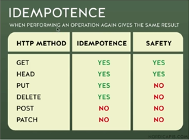

# **
Protocolo HTTP
**

## **_HyperText Transfer Protocol_**

### Protocolo de Transferência de HiperTexto

## **Visão Geral**

* ### Permite troca de informações e dados na internet

* ### Uma troca de mensagens

* ### HTML, CSS, Scripts, Imagens, Video

* ### Uma chamada para cada um desses recursos

***

## Como é feita a comunicação?

## **Browser -> Request -> Servidor**

## **Servidor -> Response -> Browser**

***

* ## [**RECURSO**]

    * ## Local a que enviarei o pedido

    * ## Usa-se uma URL para acessar o recurso

    * ## Exemplos:

        - ### **https://google.com/**

        - ### **http://localhost:3000/posts?q=oracle**

* ## [**MESSAGE**]

    * ## **Pedido** (**request**)

        * ### Methods

            * #### Definição do tipo do pedido

            * #### Qual ação deseja-se realizar no servidor

            * #### Exemplos: 

                - **Get** : pegar um _recurso_

                - **Post** : criar um _recurso_

        * ### Headers

        * ### Body

        ***

    * ## **Resposta** (**response**)

        * ### Status code

            - #### Resposta do servidor sobre o estado do pedido/resposta

            - #### Exemplos: **200** ; **301** ; **404** ; **500**

        * ### Headers

        * ### Body

        *** 

    * ## **Request** / **Response**

        * ### Headers

            - #### Campos informativos

            - #### Propriedade: Valor

            - #### Exemplos:

                - #### Content-Type: application/json

                - #### User-Agent: Chrome

                - #### Request URL: www.google.com

        * ### Body (Pode ser que exista **ou não**)

            - #### HTML

            - #### Conteúdo

            - #### JSON

        ***

## Exemplo de **REQUEST MESSAGE**

> GET /index.html HTTP/1.1  
> User-Agent: Mozilla/4.0  
> Accept: text/html

***

## Exemplo de **RESPONSE MESSAGE**

> HTTP/1.1 200 OK  
> Server: Express  
> Content-type: text/html  
> 
> `<html>...</html> `

***

# 
_Conceitos do HTTP_

* ## **_Simples_**

    * ### Legível

    * ### Qualquer pessoa

* ## **_Cliente-servidor_**

    * ### Requisição/resposta

    * ### É como pedir um lanche **(cliente)**: o lanche **(recurso)** será preparado e servido **(servidor)**.

* ## **_Stateless_**

    * ### Não guarda informações

    * ### Não existe relação entre conexões diferentes

    * ### É como jogar uma moeda. Tirar coroa não significa que sempre dará coroa.

    * ### Sessões: 

        - ### Permite guardar informações para usar na próxima conexão

        - ### Cookies

        - ### Storages

* ## **_Extensível_**

  * ### Através do cabeçalho, pode-se realizar diversas trocas de informações entre o cliente-servidor, conforme a necessidade

  * ### Headers: Informações para comunicação	

  * ### Body: Corpo do pedido ou da resposta

***

# 
_Integrantes do protocolo_

## [**CLIENTE**]

* ## Quem é o cliente?

    * ### User agent

        - ### Browser

        - ### cURL

    * ### Entidade que dá inicio à comunicação

* ## Pedidos 

    * ### Feitos através de ações do cliente (métodos HTTP)

        - ### **GET**

        - ### **POST**

        - ### **PUT**

        - ### **DELETE**

***

## [**SERVIDOR**]

* ## Se apresenta como uma máquina

* ## Preparado para ouvir e processar 

* ## Vários servidores em um computador

* ## Resposta

    * ### Headers

        - ### Status Code

            * #### 404

            * #### 500

    * ### Body

***

## [**PROXIES**]

* ## Representantes

* ## Fica entre o cliente e o servidor

* ## Ajudam a fazer o transporte de dados

* ## Diversas funções:

    * ### Cache

    * ### Filtro (como um antivírus ou controle parental)

    * ### Load balancing (distribuição da carga)

    * ### Autenticação

    * ### Autorização

***

# 
_URI_

* ## **Conceito: Uniform Resource Identifier** (identificador uniforme de recurso)

    - ## Identificar um recurso

    - ## A identificação é dada pelo **_Nome_** ou **_Localização_**

    - ## Exemplos:

        * ## Você é um Recurso

        * ## Seu nome

        * ## Sua localização
 
    *** 

* ## **Resource** (recurso)

    - ## O alvo do pedido

    - ## Qualquer coisa identificavel / Entidade

        * ## Digital

            - ### Email

            * ### Usa-se o protocolo mailto: "mailto:email@dominio.com"

        * ## Abstrata

            - ### Sessão 

            - ### Autorização

        * ## Física

            - ### Produtos

            - ### Usuários

        * ## Se podemos identificar, nomear, endereçar ou manipular, estamos falando de um recurso. 
  
***

>    ### É possível localizar um recurso pelo **Locator** (URL) ou pelo seu **Name**

***

* ## **Locator** (URL)

    - ## **Uniform Resource Locator** (localizador uniforme de recurso)

    - ## **_Toda URL é uma URI, mas nem toda URI é uma URL._**

    - ## Componentes

        * ### Obrigatórios:

            - ### Protocolo

            - ### Domínio

        * ### Opcionais:

            - ### Subdomínio

            - ### Path (caminho)

            - ### Parâmetros

            - ### Porta

            - ### Âncora   

    - ## Exemplos:

        * ### https://www.rocketseat.com.br/blog

        * ### https://www.youtube.com/watch?v=vpYct2npKD8

        * ### http://localhost:3333/index.html#algumlugar   (**3333** é um exemplo de porta; **#algumlugar** é um exemplo de âncora)

***

* ## **Name (URN)** 

    * ## **Uniform Resource Name**

    * ## Geralmente iniciado por "**_urn:_**"

    * ## Exemplos:

        - ### **urn:ibsn:0451450523**

        - ### **urn:oasis:names:specification:docbook:dtd:xml:4.1.2**

***

# 
_HTTP MESSAGES_

* ## **Mensagens**

    * ### HTTP/1.1

        * #### Legível

        * #### Texto

    * ### HTTP/2

        * #### Estrutura binária

        * #### Otimizações

        * #### Mesma maneira que a versão 1.1

    ***

## **[Request]**

* ## Request Line

    * ### Method

    * ### Protocol Version

    * ### URI

* ## Body

* ## Headers

    ***

## **[Response]**

* ## Protocol Version

* ## Status Code

* ## Header

* ## Status message

***

# 
_HTTP METHODS_

* ## Define um conjunto de métodos HTTP

* ## Indica a ação que o cliente deseja operar

* ## Podem ser chamados de **Verbos HTTP**

* ## Cada um possui a sua semântica

* ## **_Características_**: 

    * ## Seguro

        * ### Não altera o estado do servidor

        * ### Somente leitura

        * ### Cliente não solicita alterações

        * ### Não há carga extra para o servidor

        * ### O servidor é responsável em manter o método seguro

        * ### Quais são?:

            * ### GET -> GET/search.html HTTP/1.1

            * ### HEAD

            * ### OPTIONS

        ***

    * ## Idempotente

        ## 

        * ### Ao executar o método, a resposta deverá ser sempre a mesma    

        * ### Quais são?:

            * ### _Todos os seguros são idempotentes_

            * ### PUT

            * ### DELETE

        * ### Status code poderá ser diferente

        * ### O servidor tem a responsabilidade de retornar dados da mesma maneira

        * ### Essa especificação não é garantia de que todos os servidores irão aplicar o conceito corretamente

***

## **[OPTIONS]**

* ## Informações sobre disponibilidade da requisição

    * ### Exemplos:

        > ### OPTIONS /index.html HTTP/1.1
        > ### OPTIONS * HTTP/1.1

* ## **_Características:_**

    * ### Seguro: SIM

    * ### Idempotente: SIM

    * ### BODY

        * #### REQUEST: NÃO

        * #### RESPONSE: NÃO

    * ### Uso em formúlários HTML: NÃO

    * ### Cacheable: NÃO

***

## **[GET]**

* ## **Pegar** um recurso

* ## Somente recebe dados

* ## **_Características:_**

    * ### Seguro: SIM

    * ### Idempotente: SIM

    * ### BODY

        * #### REQUEST: NÃO

        * #### RESPONSE: SIM

    * ### Cacheable: SIM

    * ### Uso em formúlários HTML: SIM

***

## **[HEAD]**

* ## Semelhante ao GET, porém...

* ## ... recebemos apenas o cabeçalho 

    > ### HEAD /posts

* ## **_Características:_**

    * ### Seguro: SIM

    * ### Idempotente: SIM

    * ### BODY

        * #### REQUEST: NÃO

        * #### RESPONSE: NÃO

    * ### Uso em formúlários HTML: NÃO

    * ### Cacheable: SIM

***

## **[POST]**

* ## **Publicar/Cadastrar** um recurso

* ## **_Características:_**

    * ### Seguro: NÃO

    * ### Idempotente: NÃO

    * ### BODY

        * #### REQUEST: SIM

        * #### RESPONSE: SIM

    * ### Uso em formulários HTML: SIM

    * ### Cacheable: sim

***

## **[PUT]**

* ## Atualiza um recurso ou cria um novo

    > ### PUT /profile HTTP/1.1

    * ### Diferença entre PUT e POST?

      * #### **POST: Mais usado para criar**

      * #### **Put: Mais usado para atualizar**
    
    * ### Criação -> Status Code 201 

    * ### Atualização -> Status Code 204 ou 200

* ## **_Características:_**

    * ### Seguro: NÃO

    * ### Idempotente: SIM

    * ### BODY

        * #### REQUEST: SIM

        * #### RESPONSE: NÃO

    * ### Uso em formúlários HTML: NÃO

    * ### Cacheable: NÃO

*** 

## **[PATCH]**

* ## Modificação parcial/pontual de um recurso

    * ### Diferença entre o PUT e o PATCH

        * #### Enquanto o PUT serve para alterar um recurso por inteiro, o PATCH serve para alterar somente parcialmente.

            * #### Exemplo: usar o PATCH para alterar apenas um id a cada vez que for utilizado

        * #### O PATCH pode não ser idempotente.

    > ### PATCH /posts/1 HTTP/1.1

* ## **_Características:_**

    * ### Seguro: NÃO

    * ### Idempotente: NÃO

    * ### BODY

        * #### REQUEST: SIM

        * #### RESPONSE: SIM

    * ### Uso em formúlários HTML: NÃO

    * ### Cacheable: NÃO

***

## **[Delete]**

* ## Usado para **remover** um recurso

    > ### DELETE /posts HTTP/1.1

    * ### Status code

        * #### 202: accepted

        * #### 204: no content

        * #### 200: OK

* ## **_Características:_**

    * ### Seguro: NÃO

    * ### Idempotente: SIM

    * ### BODY

        * #### REQUEST: POSSIVELMENTE

        * #### RESPONSE: POSSIVELMENTE

    * ### Uso em formúlários HTML: NÃO

    * ### Cacheable: NÃO

***

# 
_HTTP HEADERS_

* ## Cabeçalhos

* ## Informações adicionais para o pedido ou resposta 

* ## Nome: Valor   / Property: Value / Key: Value

    * ### Exemplos:

        * ### content-type: application/json

        * ### Content-Type: text/html

***

# 
**_Dividindo Headers por contextos_**

## **[GENERAL]**

* ## **Request URL** 

    * ### https://www.google.com/

* ## **Request Method**

    * ### GET

* ## **Status Code**

    * ### 200, 204, 301 etc.

* ## **Remote Adress**

    * ### 172.217.173.110:443

* ## **Referrer Policy**

    * ### strict-origin-when-cross-origin

***

## **[REQUEST HEADERS]**

* ## **:authority:**

    * ### google.com

* ## **:method:**

    * ### GET

* ## **:path:**

    * ### /

* ## **:scheme:**

    * ### https

* ## **accept:**

    * ### text/html, application/json, image/png etc.

* ## **accept-encoding:**

    * ### gzip, deflate, br

* ## **accept-language:**

    * ### en-US ; pt-BR

* ## **cache-control:**

    * ### no-cache
  
* ## entre outros...

***

## **[RESPONSE HEADERS]**

* ## **cache-control:**

    * ### public, max-age=2592000

* ## **content-encoding:**

    * ### br

* ## **content-length:**

    * ### 220

* ## **content-type:**

    * ### text/html; charset=UTF-8

* ## **date:**

    * ### Fri, 16 Apr 2022 02:58:00 GMT

***

# 
_Status code_

# **100**

* ## 100: continue

# **200**

* ## 200: OK (GET, POST)

* ## 201: Created (PUT)

* ## 204: No Content (DELETE, PUT)

# **300**

* ## 301: Moved Permanently

* ## 302: Found

* ## 307: Temporary Redirect
 
* ## 308: Permanent Redirect

# **400**

* ## 400: Bad Request

* ## 401: Unauthorized

* ## 403: Forbidden

* ## 404: Not Found

* ## 405: Method not allowed

# **500**

* ## 500: Internal Server Error

* ## 503: Service Unavailable