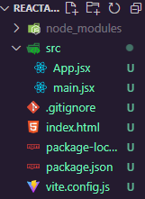
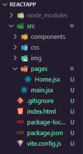
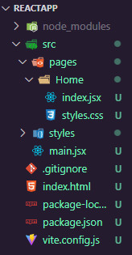

# **<center><font size=10 color="lightblue">REACT</font></center>**

## <center> [Documentação React.js](https://pt-br.reactjs.org/docs/getting-started.html)

- ## Consiste numa biblioteca de JavaScript para a criação de interfaces de usuário (UI's).

- ## Utiliza bastante o paradigma de **_programação funcional_**

---

- ## **<font color=orange size=5>[Criando projeto]</font>**

  - ### Para a criação do diretório do projeto em ReactJS, pode ser usado no terminal o comando <kbd>npx create-react-app</kbd> ou então usando a ferramenta Vite, mais eficiente:

    > ### <font color=cyan>npm create vite@latest nome-do-projeto --template react</font>

  - ### Após isso, é necessário instalar as dependências do projeto com um:

    > ### <font color=cyan>npm install</font>

  ***

- ## **<font color=orange size=5>[Executando projeto]</font>**

  - ### Para executar o projeto criado, utiliza-se o comando:

    > ### <font color=cyan>npm run dev</font>

  ***

- ## **<font color=orange size=5>[JSX]</font>**

  - ### Trata-se da sintaxe utilizada por aplicações ReactJS para criar as interfaces de forma declarativa

  - ### É sempre uma **função**, cujo retorno é um componente **HTML** a ser renderizado

  - ### Exemplo (navbar.jsx):

    ```jsx
    function Navbar() {
      return (
        <nav>
          <p>Exemplo</p>
        </nav>
      )
    }
    export default Navbar
    ```

  - ### Existem duas formas de escrever comentários num arquivo **JSX**:

    - ### Na parte da lógica do componente:

      ```jsx
      import React from "react"

      // Algum comentário

      const component = () => {
        return <div>Exemplo</div>
      }

      export default component
      ```

    - ### No próprio JSX (retorno do componente):

      ```jsx
      import React from 'react'

      const componente = () => {
        return (
          { /* Algum comentário */}
          <div>Exemplo</div>
        )
      }

      export default componente
      ```

  - ### Também é possível renderizar componentes de forma declarativa, ou seja, como uma tag HTML, uma vez que os tenha importado:

    ```jsx
    import Navbar from './Navbar'

    function Header() {
        return (
            <Navbar />
            <p>lorem ipsum</p>
        )
    }
    export default Header
    ```

  - ### Arquivos JSX não precisam ser importados com sua extensão ".jsx"

    ```jsx
    import Navbar from "./Navbar"
    ```

  - ### Para definir uma classe no retorn HTML do JSX, o react utiliza-se de "className" no lugar do convencional "class":

    ```jsx
    function Home() {
      return <div className="nomeDaClasse">Lorem Ipsum</div>
    }
    ```

  ***

- ## **<font color=orange size=5>[Template Expressions]</font>**

  - ### trata-se do recurso que permite executar **javascript dentro do JSX** e também interpolar variáveis.

  - ### A sintaxe é: { algumCódigoEmJS }

    - #### Tudo que está entre chaves é processado em javascript e retorna um resultado

  - ### **Exemplo:**

  ```jsx
  import React from "react"

  const name = "Kaik"

  const componente = () => {
    return <div>Olá, {name}! Tudo bem?</div>
  }

  export default componente
  ```

  > #### Neste caso, o conteúdo da div seria: **Olá, Kaik! Tudo bem?**

  ***

- ## **<font color=orange size=5>[Eventos]</font>**

  - ### São essenciais para o desenvolvimento front-end, uma vez que compoem a interação da aplicação com o usuário.

  - ### No React, os eventos já estão 'prontos', podemos utilizar, por exemplo, o evento **OnClick** para ativar uma função ao clicar em um elemento.

  ## **<font color=orange>[Funções nos eventos]</font>**

  - ### Esta função será realizada ao acionar o evento como o OnClick e deve ser criada no próprio componente.

  - ### Por padrão seu nome é do tipo: <font color="cyan">**handleAlgumaCoisa**</font>

  - ### Estas funções sempre recebem como parâmetro o evento acionado, geralmente abreviado por "e"

    ```jsx
    const handleClick = function (e) {
      console.log(e)
    }

    return <button OnClick={handleClick}>Clique aqui</button>
    ```

    - > #### ao clicar neste botão, a função handleClick será ativada, logando no console o evento em si.

    ***

  - ### Também é possível passar uma arrow function diretamente no elemento do JSX:

    ```jsx
    return (
        <div>
            <button onClick=>{(e) => console.log(e)} >
                Clique aqui também
            </button>
        </div>
    )
    ```

    - > #### ao clicar neste botão, a função handleClick também será ativada, logando no console o evento em si.

  ***

- ## **<font color=orange size=5>[Funções de renderização]</font>**

  - ### Podemos criar funções que retornam JSX

  - ### Isto serve para criar situações que **dependam de outras condições**.

  - ### Ou seja, o JSX a ser renderizado pode mudar a depender de uma variável.

  - ## **Exemplo:**

    - ### Uma função que retorna um parágrafo dizendo "Ímpar" se o número passado como parâmetro for ímpar e "Par" caso for par.

      #### <center>Definindo a função

      ```jsx
      const parOuImpar = function (numero) {
        if (numero % 2 == 0) {
          return <span>Par</span>
        } else if (numero % 2 == 1) {
          return <span>Ímpar</span>
        }
      }
      ```

      #### <center>Utilizando a função

      ```jsx
      // ... definição do componente

      return <p>O número 5 é... {parOuImpar(5)}!</p>
      ```

      > #### <center> a frase do parágrafo seria: <font color=cyan>**O número 5 é... Ímpar!**</font>

  ***

- ## **<font color=orange size=5>[Estrutura de pastas e arquivos]</font>**

  - ### Os arquivos possuem uma estrutura flexível, porém com uma base comum:

    <center>

  

    </center>

  - ### O diretório **src** também pode receber outros diretórios para imagens, componentes, estilos etc.:

    <center>

  

    </center>

  ***

- ## **<font color=orange size=5>[Fragment]</font>**

  - ### Trata-se de uma pequena regra sobre como deve ser o retorno dos componentes <kbd><font color=cyan>.jsx</font></kbd>

  - ### Expressões JSX pode ter apenas um único elemento filho. (Uma tag vazia ou uma div encapsulando todo o resto servem)

    ```jsx
    function Home() {
      return (
        <>
          <h1>Lista de presença</h1>
          <input type="text" />
          <button>Adicionar</button>
        </>
      )
    }

    export default Home
    ```

  ***

- ## **<font color=orange size=5>[Importando CSS]</font>**

  - ### <font color=ligblue>CSS</font>

    ### global.css

    ```css
    * {
      margin: 0;
      padding: 0;
      box-sizing: border-box;
    }
    ```

  - ### <font color=tomato>JSX</font>

    ### main.jsx

    ```jsx
    import React from "react"
    import ReactDOM from "react-dom/client"

    import "./styles/global.css"

    import Home from "./pages/Home"

    ReactDOM.createRoot(document.getElementById("root")).render(
      <React.StrictMode>
        <Home />
      </React.StrictMode>
    )
    ```

  ***

- ## **<font color=orange size=5>[Separando CSS]</font>**

  - ### Refatorando um pouco a estrutura de arquivos dentro das pastas do projeto em React, é possível separar os estilos de cada componente.

    <center>

  

    </center>

  - ### O arquivo que antes era Home.jsx passa a ser de um diretório chamado Home e se chamar index.jsx, assim, não é necessário alterar importações. Uma vez que na pasta Home o componente **index.jsx** importa os estilos de **styles.css**, o componente Home será exportado já com estes estilos.

  ***

- ## **<font color=orange size=5>[Componentes]</font>**

  - ### O uso da componentização está diretamente associado à boa manutenção do código, uma vez que, com os elementos separados, é fácil a visualização e alteração de comportamento de cada elemento de uma aplicação.

  - ### Ao utilizarem-se partes fragmentadas de uma aplicação, torna-se possível a reutilização de componentes, como, por exemplo, um rodapé que se repete em múltiplas (quiçá todas) páginas da aplicação.

  - ### **Exemplo:**

    ### Componente

    ```jsx
    function Card() {
      return (
        <div className="card">
          <strong>Kaik Barreto</strong>
          <small>10:15:24</small>
        </div>
      )
    }

    export default Card
    ```

    ### Reutilização do component **_Card_** (3x)

    ```jsx
    import Card from "../../components/Card"

    function Home() {
      return (
        <div>
          <Card />
          <Card />
          <Card />
        </div>
      )
    }
    export default Home
    ```

  ***

- ## **<font color=orange size=5>[Props (Propriedades/Parâmetros)]</font>**

  - ### Componentes JSX (que são funções) podem receber parâmetros, dinamizando a declaração de um componente na aplicação.

  - ### Exemplo: Imprimir na tela um cartão com nome e data, os quais serão recebidos como parâmetros/propriedades.

    ***

    ### <font color=cyan>Criação do componente dinâmico</font>

    ```jsx
    import "./styles.css"

    function Card(props) {
      return (
        <div className="card">
          <strong>{props.name}</strong>
          <small>{props.time}</small>
        </div>
      )
    }

    export default Card
    ```

    - ### A keyword **props** permite que as propriedades sejam ilimitadas, cujos nomes venham após **<font color=lime>"props."</font>**

    ***

    ### <font color=cyan>Utilização dinâmica do componente, atribuindo valores na declaração do componente</font>

    ```jsx
    import Card from "../../components/Card"

    function Home() {
      return (
        <div>
          <Card name="Kaik Barreto" time="10:55:25" />
          <Card name="João Feliciano" time="11:00:10" />
        </div>
      )
    }

    export default Home
    ```

    ***

  - ### **Também é possível passar propriedades/parâmetros específicos no componente**

    ### <font color=cyan>Criação do componente dinâmico</font>

    ```jsx
    function Card({ name, time }) {
      return (
        <div>
          <strong>{name}</strong>
          <small>{time}</small>
        </div>
      )
    }
    ```

    ***

    ### <font color=cyan>Utilização dinâmica do componente, atribuindo valores na declaração do componente</font>

    ```jsx
    import Card from "../../components/Card"
    function Home() {
      return (
        <div>
          <Card name="Fulano" time="08:50:38" />
        </div>
      )
    }
    export default Home
    ```

    ***

- ## **<font color=orange size=5>[A prop children]</font>**

  - ### é um recurso utilizado para quando um componente **precisa ter JSX dentro dele, porém este JSX vem do componente pai**.

  - ### Então o componente age como um **container**, abraçando estes elementos.

  - ### E children é considerada uma **prop do componente**.

  - ### **Exemplo:**

    #### <center> Um Container que possa receber html dentro de si ao ser utilizado e imprima este html interior atraves da **prop children**.

    - #### Criação do componente

      ```jsx
      const Container = ({ children }) => {
        return (
          <>
            <h2>Título</h2>
            {children}
          </>
        )
      }
      ```

    - #### Utilização do componente Container no componente pai

      ```jsx
      const App = () => {
        return (
          <Container>
            <p>conteúdo interno</p>
          </Container>
        )
      }
      ```

    - #### <center> <font color=cyan>Será renderizado o seguinte:</font>

      ```jsx
      <Container>
        <h2>Título</h2>
        <p>conteúdo interno</p>
      </Container>
      ```

    #### <center> <font color=cyan>Observe que o "{children}" do componente Container foi substituído pelo que estava dentro da tag Container.</font>

  ***

- ## **<font color=orange size=5>[Função como prop]</font>**

  - ### As **funções podem ser passadas como argumento/parâmetro** para um componente filho **via props**.

  - ### Basta criar uma função no componente pai e **enviar como prop** para o componente

  - ### **No componente filho ela pode ser ativada por um evento**.

  - ### **Exemplo:**

    ### <center> No componente pai:

    ```jsx
    const Pai = () => {
      function mostrarMensagem() {
        console.log("Evento do componente pai!")
      }

      return (
        <div>
          <Filho funcaoHerdada={mostrarMensagem} />
        </div>
      )
    }
    ```

    ### <center> No componente filho:

    ```jsx
    const Filho = ({ funcaoHerdada }) => {
      return (
        <div>
          <button onClick={funcaoHerdada}>
            Clique aqui para disparar a função herdada.
          </button>
        </div>
      )
    }
    ```

    #### <center> A função **mostarMensagem( )** foi passada do componente **[Pai]** para o componente **[Filho]**. Assim, o componente **[Filho]** consegue acessar e executar essa função através da Prop **[funcaoHerdada]**

  ***

- ## **<font color=orange size=5>[Estado/State]</font>**

  - ### Trata-se de onde se guardam os dados, o estado do componente

  - ### A diferença do **Estado/State** para uma variável comum é que o estado, ao ser alterado, renderiza novamente o componente

  - ### O estado possui 2 elementos em forma de vetor/array: o primeiro é o conteúdo/valor do estado e o segundo é uma função que atualiza o valor do estado pelo parâmetro recebido:

    ```jsx
    const [nome, setNome] = useState()

    setNome("Kaik") // nome se torna Kaik
    setNome("João") // nome se torna João
    ```

  - ### O método **useState()** pode receber como argumento um valor inicial para o estado

    - #### Exemplo, um nome que é atualizado baseado no estado, porém que começa sendo Kaik

      ```jsx
      const [idade, setIdade] = useState(29)
      // idade começa como 29
      setIdade(30) // idade se torna 30
      ```

  - ### Por exemplo, pode-se guardar o valor de um input e atualizá-lo a cada vez que for alterado

    ```jsx
    import React, { useState } from "react"
    import Card from "../../components/Card"

    function Home() {
      const [personName, setPersonName] = useState()

      function handleNameChange(name) {
        setPersonName(name)
      }

      return (
        <div className="container">
          <h1>Nome: {personName}</h1>
          <input
            type="text"
            placeholder="Digite o nome..."
            onChange={(e) => handleNameChange(e.target.value)}
          />
        </div>
      )
    }
    export default Home
    ```

    - ### Note-se que a importação <font color=lime>[import React, { useState } from 'react']</font> é indispensável para a utilização do estado

    - ### Resultado: O "{personName} do H1 será atualizado para o valor do input a cada vez que ele for alterado.

  ***

- ## **<font color=orange size=5>[Imutabilidade]</font>**

  - ### É o princípio que os estados do ReactJS respeitam

  - ### Faz parte do paradigma de **programação funcional**

  - ### **_O conteúdo não deve ser alterado, mas sim substituído_**

    - #### Esse conceito torna a aplicação mais performática

    - #### Por isso não se atualiza o valor do estado diretamente, mas sim utiliza-se uma função para substituí-lo

    - ### **Exemplo:**

      ### <font color=lime>**Certo**</font>

      ```jsx
      const [cityName, setCityName] = useState()

      setCityName("Nova York") // substituição do valor
      // cityName torna-se Nova York
      ```

      ### <font color=red>**Errado**</font>

      ```jsx
      const [cityName, setCityName] = useState()

      cityName = "Nova York" // atualização do valor
      ```

  ***

- ## **<font color=orange size=5>[Renderização de Listas]</font>**

  - ### É possível, com uma sintaxe específica, renderizar dados de um array ou object literal (e muitas vezes arrays de objetos) numa estrutura de repetição dentro do template em React.

  - ### Por padrão, utiliza-se o método **map** para iterar sobre o array.

  - ### Além dos dados, é possível **inserir JSX** em cada iteração.

  - ### **Ex.:**

    #### <center> Adicionar à ul (lista) um li (list item) **para cada fruta no array frutas**.

    ```jsx
    import { useState } from 'react'

    const componente = () => {
        const [frutas] = useState(["Maçã", "Banana", "Melancia", "Morango"])

        return <div>
            <ul>
                {frutas.map((fruta) => (
                    <li key={frutas.indexOf(fruta}>
                      {fruta}
                    </li>
                )}
            </ul>
        </div>
    }
    ```

  ## <font color="orange">**Renderização de componentes em loop**</font>

  - ### Utilizando dos conceitos de **renderização de listas**, **reaproveitamento de componentes** e **props**, podemos utilizar uma estrutura de repetição como o **map** para exibir múltiplas instâncias de um componente, dinamicamente.

  - ### **Exemplo:**

    ```jsx
    const carros = [
      { id: 1, marca: "Ferrari", modelo: "F8" },
      { id: 2, marca: "Lamborghini", modelo: "Gallardo" },
      { id: 3, marca: "Rolls Royce", modelo: "Phantom" },
    ]

    return (
      <ul>
        {carros.map((carro) => (
          <li key={carro.id}>
            <Carro marca={carro.marca} modelo={carro.modelo} />
          </li>
        ))}
      </ul>
    )
    ```

    #### <center> Neste caso, para cada carro no array de carros, é renderizado um **li (list item)**, cuja **key** é o **ID** do carro, contendo um componente **Carro** que recebe as props **marca** e **modelo**.

  ***

- ## **<font color=orange size=5>[Key Prop]</font>**

  - ### Ao utilizar uma estrutura de repetição **_[.map(), .forEach() etc.]_** para gerar componentes dinâmicos, há a necessidade de acrescentar uma propriedade chamada "key", que seja única, ou seja, que não se repita.

  - ### A necessidade da atribuição desta propriedade é para que o react use esta chave para identificar os elementos da lista corretamente

  - ### **Exemplo:**

    #### <center> um Card **para cada fruta no array de frutas**, onde a key prop é um ID de cada fruta e a name prop é o nome de cada fruta.

    ```jsx
    {
      frutas.map((fruta) => <Card key={fruta.ID} name={fruta.nome} />)
    }
    ```

    - ### Neste exemplo, a chave é o próprio horário, que, neste caso, não se repetirá entre as gerações de componentes

  ***

- ## **<font color=orange size=5>[Renderização Condicional]</font>**

  - ### Trata-se da **impressão de uma parte do template baseada em uma condição**, ou seja, utilizando as estruturas condicionais do Javascript **if** e **else**.

  - ### Um uso comum deste tipo de renderização é, por exemplo, um determinado componente ser mostrado caso o usuário esteja logado e não ser mostrado caso não esteja.

  - ### **Exemplo:**

    #### <center><font color=yellow>**exibir um nome no template caso ele comece com a letra K (condicional simples)**</font>

    ```jsx
    const nome = "Kaik"

    const [começaComK] = useState(nome.startsWith("K"))

    return <div>{começaComK && <p>{nome}</p>}</div>
    ```

    #### <center>Como a variável nome é uma string que começa com K, a variável "começaComK" inicia-se com o estado true. Sendo true, o paragrafo contendo o nome é renderizado.

    ***

  ## <font color=orange>**Condicional Composta**</font>

  - ### Para expressar uma condicional com if e else no JSX, utilizam-se os operadores ternários, da seguinte maneira:

      <center>

    <font color=cyan size=4>condição <font color=yellow>?</font>
    <font color=lime>blocoSeVerdadeiro</font> <font color=yellow>:</font>
    <font color=red>blocoSeFalso</font></font>

  - ### **Exemplo:**

    ```jsx
    const nome = "Kaik"

    const [começaComK] = useState(nome.startsWith("K"))

    return (
      <div>{começaComK ? <p>Começa com K</p> : <p>Não começa com K</p>}</div>
    )
    ```

    #### <center> `Assim, caso o valor de [começaComK] seja [true], o parágrafo após [?] será renderizado, caso seja [false], o parágrafo após [:] será renderizado.`

  ***

## <center>**<font color=orange size=7>Hooks (conceito)</font>**

- ### São recursos do React que têm diversas funções, como, por exemplo, guardar e alterar o estado de algum dado na aplicação etc.

- ### Eles permitem que usem-se o state e outros recursos do React sem escrever uma classe

- ### Geralmente seus nomes começam com <font color=lime>**use**</font> e então o nome do **Hook**.

  - #### Ex.: **[<font color=lime>useState, useEffect</font>]**

- ### É possível criar nossos próprios hooks, que ganham o nome de **Custom Hook**

- ### Hooks precisam ser importados e são usados em praticamente toda aplicação React atual.

---

## <center>**<font color=orange size=7>Entendendo os Hooks</font>**

## <center>[React Hooks Cheatsheet (consulta)](https://react-hooks-cheatsheet.com/)

# <center>[React Hooks Explained (explicação em vídeo)](https://www.youtube.com/watch?v=TNhaISOUy6Q&t=410s)

- ## **<font color=orange size=5>[useState]</font>**

  - ### O **useState** é o hook mais utilizado e serve para **gerenciar o estado de algum dado**, sendo esta a única forma de alterar uma varíavel e re-renderizá-la no React.

  - ### Para guardar o dado, utilizamos o retorno da função useState( ), que é uma lista com a variável e uma função para alterar o estado da variável.

  - ### O hook useState recebe como parâmetro o estado inicial da variável a ser criada.

  - ### **Exemplo:**

    #### <center> variável **nome**, cujo valor inicial é **"Kaik"**

    ```jsx
    // importação do useState
    import { useState } from "react"

    // criação da variável
    const [nome, setNome] = useState("Kaik")

    // alteração do estado usando a função retornada pelo useState
    setNome("Matheus")
    // nome passa a ser "Matheus"

    console.log(nome) // Matheus
    ```

    #### <center> `A cada vez que é alterado o valor da variável com a função setVariável(), o componente é renderizado novamente, sem dar reload na página.`

    ***

  ## **<font color=orange>previous state</font>**

  - ### **Previous state** é um recurso que nos permite pegar o dado em seu valor original dentro de um **set** de dado.

  - ### Isso é muito utilizado para **modificar listas**, transformando o valor antigo em um novo valor.

  - ### O **primeiro argumento** de um **set** sempre será o **previous state**, ou seja, o estado prévio (anterior) do dado, geralmente chamado simplesmente **`state`**, porém pode ser qualquer nome.

  - ### **Exemplos:**

    #### <center><font color=yellow>**1. mudar o estado do número para o sucessor do mesmo**</font>

    ```jsx
    // iniciando uma variável numero com o estado 0.
    const [numero, setNumero] = useState(0)

    setNumero((state) => {
      return state + 1
    })
    ```

    #### <center>O set da variável número recebe como parâmetro uma outra função que usa o valor original do número (state) para retornar seu sucessor (state + 1) e alterar o estado para este novo número.

    ***

    #### <center><font color=yellow>**2. Alterar o estado de uma lista ao passar seu valor original por um filtro**</font>

    ```jsx
    // iniciando uma variável nomes
    const [nomes, setNomes] = useState([
      "Kaik",
      "Matheus",
      "Rafaella",
      "Maicon",
      "Maria",
    ])

    setNomes((actualNomes) => {
      return actualNomes.filter((nome) => nome.startsWith("M"))
    })

    console.log(nomes)
    // ["Matheus", "Maicon", "Maria"]
    ```

    #### <center>O set da variável nomes recebe como parâmetro uma outra função que usa o array original de nomes para retornar um novo array apenas com nomes que comecem com "M".

  ***

  - ## **<font color=orange size=5>[State Lift / Elevação de estado]</font>**

    - ### Elevação de estado ou state lift **é quando um valor é elevado do componente filho para o componente pai**.

    - ### Geralmente, tem-se **um componente que usa o state e outro que o altera**.

    - ### Então, precisa-se **passar a alteração para o componente pai, e este passa para o componente que usa o state**.

    - ### **Exemplo:**

      ### <center> No componente pai:

      ```jsx
      const Pai = () => {
        const [message, setMessage] = useState("")

        function handleMessage(msg) {
          setMessage(msg)
        }

        return (
          <div>
            <Message msg={message} />
            <ChangeMessage handleMessage={handleMessage} />
          </div>
        )
      }
      ```

      - #### <center> `Neste exemplo, o componente [Pai] administra o estado da variável message.`

      - #### <center> O componente [Message] <font color=cyan>**recebe a variável message para consumí-la**</font>

      - #### <center> O componente [ChangeMessage] <font color=red>**recebe a variável message para alterá-la**</font> e elevar este novo estado para o componente pai, renderizando novamente todos os componentes que consomem esta variável.

      ***

    ## **<font color=orange>useState e inputs</font>**

    - ### **Atrelando o useState a um input**, é possível alterar o valor de um estado **toda vez que houver mudança no input**, por meio do evento **onChange**

      - #### Exemplo:

        ```jsx
        const [nome, setNome] = useState("")

        return (
          <input
          type="text"
          name="nome"
          onChange={(e) -> setNome(e.target.value)}
          />
        )
        ```

        - #### Assim, a cada alteração do input, o estado **`nome`** receberá o valor do input.

  ***

- ## **<font color=orange size=5>[useEffect]</font>**

  - ### É um Hook utilizado para realizar uma função passada como parâmetro toda vez que um estado do array de dependências (também passado como parâmetro) for alterado.

  - ### O **useEffect** é executado automaticamente **_assim que a interface é renderizada_**

  - ### **Sintaxe**:

    - ### recebe como parâmetros uma função **_(corpo)_** e um array **_(dependências)_**

      ```jsx
      useEffect(() => {
        // corpo do useEffect
      }, []) // array de dependências
      ```

    - ### O array de dependências recebe os estados de que o useEffect depende.

      - #### O array vazio significa que o useEffect será realizado uma única vez

      - #### Ao inserir um estado nas dependências, toda vez que este estado for atualizado o useEffect será executado novamente

      - #### **Exemplo:**

        ```jsx
        useEffect(() => {
          console.log("Alguém entrou na lista")
        }, [lista])
        // toda vez que um estado da lista é alterado, o useEffect é disparado, imprimindo no console que "Alguém entrou na lista"
        ```

    ***

- ## **<font color=orange size=5>[useReducer]</font>**

  - ### O useReducer tem a mesma função que o useState, ou seja, gerenciar valores. Porém, com este hook, há a possibilidade de **`executar uma função na hora da alteração do valor`**.

  - ### Então, tem-se que o useReducer recebe um **`valor`** para gerenciar e **`uma função`** (geralmente chamada **_dispatch_**) para alterar este valor.

  - ### **Exemplo:**

    ```jsx
    const Componente = () => {

      const [number, dispatch] = useReducer({state, action} => {
        return state * 2
      })

      return (
        <p>Número: {number}</p>
        <button
          onClick={dispatch}
        >
          Dobrar número!
        </button>
      )
    }
    ```

  - ### Neste caso, a função do useReducer (por convenção chamada **_dispatch_**) tem acesso ao estado atual da variável **_number_**, e, à cada vez que é chamada, altera o valor da mesma para o dobro.

  ***

- ## **<font color=orange size=5>[useReducer com actions]</font>**

  - ### A vantagem de se utilizar o useReducer em detrimento do useState é conter **_`operações mais complexas`_**, utilizando a estrutura de **_`switch com actions`_**.

## <center> **Exemplo:**

#### <center> Incrementando ou diminuindo um valor com reducer

```jsx
function App() {

  function contadorReducer(state, action) {
    switch(action.type) {
      case 'increment':
        return state + 1
      case 'decrement':
        return state - 1
      default:
        return throw new Error(("Tipo inválido")
    }
  }

  const [contador, countDispatch] = useReducer(contadorReducer, 0)

  return (
    <>
      Contador: {contador}
      <button
      onClick={() => countDispatch({ type: "increment" })}>incrementar</button>

      <button
      onClick={() => countDispatch({ type: "decrement" })}> diminuir</button>

    </>
  )
}
```

- ### Assim, o useReducer age em três instâncias:

  1. ### na **_declaração do useReducer_**:

     - #### este recebe como argumento a função que tratará a mudança de estado baseado na **_action_** passada como argumento na função **_countDispatch._** Como segundo argumento recebe o estado inicial da variável

     - #### também retorna o estado (neste caso **_contador_**) e uma função de **_countDispatch_**, que envia uma **_action_** para a função tratadora (neste caso **_contadorReducer_**).

       ```jsx
       const [contador, countDispatch] = useReducer(contadorReducer, 0)
       ```

     ***

  2. ### na **_declaração da função de tratamento_**:

     - #### esta possui acesso ao estado atual da variável e também recebe como **_parâmetro_** uma action, que será usada de parâmetro para a manipulação do estado da variável.

     - #### Por exemplo, caso o tipo do objeto action passado como argumento via countDispatch seja igual a "increment", o estado será **aumentado** em 1. Por outro lado, caso a action seja "decrement", o estado será **diminuído** em 1.

       ```jsx
       function contadorReducer(state, action) {
         switch(action.type) {
           case 'increment':
             return state + 1
           case 'decrement':
             return state - 1
           default:
             return throw new Error(("Tipo inválido")
         }
       }
       ```

  3. ### no **_uso do reducer_**:

     - #### geralmente é ao disparo de um evento que será realizada a mudança de estado, porém, com o useReducer esta mudança terá uma action, ou seja, um tipo diferente de alteração, como **incrementar** ou **diminuir** um estado.

       ```jsx
       return (
         <>
           Contador: {contador}
           <button onClick={() => countDispatch({ type: "increment" })}>
             incrementar
           </button>
           <button onClick={() => countDispatch({ type: "decrement" })}>
             {" "}
             diminuir
           </button>
         </>
       )
       ```

  ***

- ## **<font color=orange size=5>[useContext]</font>**

  - ### é utilizado para **_consumir o valor de um contexto compartilhado entre componentes_**

  - ### Mais informações sobre o uso de contextos na seção **_[CONTEXT API]_**

  - ### **Exemplo:**

    ```jsx
    import { useContext } from "react"
    import { CountContext } from "../context/CountContext"

    const App = () => {
      const { contador } = useContext(CountContext)

      return <p>Valor do contexto {contador}</p>
    }
    ```

    ***

- ## **<font color=orange size=5>[useRef]</font>**

  - ### o useRef pode ser utilizado como o useState para gerenciar valores, a diferença é que ele é um **_objeto_** e seu valor está na propriedade **_current_**.

  - ### Outra particularidade do **_useRef_** é que ele <font color=cyan>não re-renderiza o componente ao ser alterado</font>, o que pode ser útil em alguns casos.

  - ### **_Exemplo:_**

    #### <center> a referência (**_counterRef_**) que mapeia quantas vezes o componente foi re-renderizado (ativação do useEffect).

    ```jsx
    import { useRef, useEffect, useState } from "react"

    const Component = () => {
      const counterRef = useRef(0)
      const [counter, setCounter] = useState(0)

      useEffect(() => {
        counterRef.current = counterRef.current + 1
      })

      return (
        <div>
          <p>Valor da referência: {counterRef.current}</p>

          <p>Valor do contador: {counter}</p>

          <button onClick={() => setCounter(counter + 1)}>
            Aumentar contador
          </button>
        </div>
      )
    }
    ```

  - ### Outra utilização interessante do **_useRef_** é <font color=tomato>selecionar elementos do **_JSX_**</font>. Com isso, é possível fazer <font color=tomato>manipulação de DOM ou aplicar funções como a focus</font>, que foca num input, por exemplo.

  - ### **_Exemplo:_**

    ```jsx
    import { useRef } from "react"

    const Component = () => {
      const inputRef = useRef()
      const [text, setText] = useState("")

      const handleSubmit = (e) => {
        e.preventDefault()

        inputRef.current.focus()
      }

      return (
        <form onSubmit={handleSubmit}>
          <input
            type="text"
            ref={inputRef}
            value={text}
            onChange={(e) => setText(e.target.value)}
          />

          <input type="submit" value="Enviar" />
        </form>
      )
    }
    ```

    > #### Como na função handleSubmit é utilizado o método **_focus_**, ao enviar o formulário o input atrelado ao **_inputRef_** será focado.

    #### <center> Desta forma, a variável **`inputRef`** é preenchida com um objeto contendo todas as características do input. Para atrelar o **_inputRef_** com o input utilizou-se o **_atributo "ref"_** do input.

  ***

- ## **<font color=orange size=5>[useCallback]</font>**

  - ### Basicamente, serve para <font color=tomato>**_memorizar uma função_**</font>, fazendo ela <font color=tomato>**_NÃO ser reconstruída a cada renderização_**</font> de um componente.

  - ### O hook de **_useCallback_** pode ser utilizado para duas situações:

    1. ### Quando preza-se pela <font color=tomato>**_performance_**</font>, então, deseja-se que uma função complexa não seja reconstruída toda vez.

    2. ### Quando <font color=#5fd>o próprio react indica que uma função deveria estar contida em um useCallback</font> para evitar problemas de performance.

  - ### **_Exemplo:_**

    ```jsx
    import { useCallback, useState } from 'react'

    import Lista from "./Lista"

    const Componente = () => {

      const [counter, setCounter] = useState(0)

      const getItemsFromDatabase = useCallback(() => {
        return ["a", "b", "c", "d", "e", "f"]
      }, [])

      return <div>
        <List getItems={getItemsFromDatabase} />

        <button
          onClick={() => setCounter(counter + 1)}
        >Acrescentar 1</button>

        <p>{counter}</p>
      <div>
    }
    ```

    > #### Ou seja, o useCallback **_envelopa_** uma função, realizando seu carregamento somente quando necessário.

    #### <center style="text-align:justify; letter-spacing: 1px; background: #1d1e20; padding: 10px; border-radius:25px; font-size:1.2em; color:#0fdf89"> O useCallback também recebe como argumento um array de dependências, semelhantemente ao useEffect, porém neste caso sua execução depende apenas do carregamento da função 'getItemsFromDatabase'.

  ***

- ## **<font color=orange size=5>[useMemo]</font>**

  - ### o **_useMemo_** pode ser utilizado para garantir a **_referência de um objeto_**, fazendo com que algo possa ser atrelado a uma referência e não um valor. Com isso consegue-se <font color=tomato>condicionar useEffects a uma variável</font> de maneira mais inteligente.

  - ### É como se a utilização do ***useMemo*** fosse igual à do ***useCallback***, mas ao invés de uma função, envolve valores.

  - ### **_Exemplo:_**

    ```jsx
    import { useState, useEffect, useMemo } from "react"

    const Componente = () => {
      const [number, setNumber] = useState()

      const premiumNumbers = useMemo(() => {
        return ["0", "10", "200"]
      }, [])

      useEffect(() => {

        console.log("a variável premiumNumbers foi alterada")

      }, [premiumNumbers])

      return <div>
        <input 
          type="text"
          onChange={(e) => setNumber(e.target.value)}
        />
        {premiumNumbers.includes(number) 
        ? <p>Acertou o número</p> 
        : ""}
      </div>
    }
    ```

    #### Desta maneira, o useMemo guarda de forma inteligente os valores, para que este não precise ser lido **TODA VEZ** que, por exemplo, o useEffect que o carrega como dependência seja executado ao iterar sobre a variável **premiumNumbers**.

  ---

- ## **<font color=orange size=5>[useLayoutEffect]</font>**

  - ### É muito parecido com o ***useEffect***, a grande diferença é que este hook <font color=tomato>roda antes de renderizar o componente</font>, ou seja: o hook é ***síncrono***, bloqueando o carregamento da página para o sucesso de sua funcionalidade.

  - ### A ideia é executar algo antes que o usuário veja a página.

  - ### ***Exemplo:***

    ```jsx
    import { useLayoutEffect, useEffect, useState } from 'react'

    const Componente = () => {

      const [name, setName] = useState("Nome inicial")

      useEffect(() => {

        console.log("2")
        setName("Outro novo nome")

      }, [])

      useLayoutEffect(() => {
        console.log("1")
        setName("Novo nome")
      }, [])

      return <div>
        <p>Nome: {name}</p>
      </div>
    }
    ```

    ### <center> Neste caso, ainda que o **useEffect** venha antes no código, a ação do <font color=tomato>***useLayoutEffect***</font> será realizada primeiro!

  ---

- ## **<font color=orange size=5>[useImperativeHandle]</font>**

  ### <center><span style="font-style: italic; font-weight: bold; color: tomato; background-color: #1d1e20;%;">"Componente pai executando função no componente filho"</span>

  - ### com o hook <font color=cyan>***useImperativeHandle***</font> é possível acionar ações em outro componente de forma imperativa (de cima pra baixo).

  - ### Como não é possível passar refs como props, precisa-se utilizar, para este fim, uma função ***`forwardRef`***, que permite passar as referências.

  - ### ***Exemplo:***

    ## <center> 1 - No componente pai

    ```jsx
    import { useRef } from 'react'

    import ComponenteFilho from './ComponenteFilho'

    const ComponentePai = () => {

      const componentRef = useRef()

      const

      return (
        <div>
          <!-- Referenciação -->
          <ComponenteFilho ref={componentRef} />
          <!-- execução da função do comp. filho -->
          <button
            onClick={() componentRef.current.validate()}
          >Validate</button>
        </div>
      )
    }
    ```

    ## <center> 2 - No componente filho

    ```jsx
    import { forwardRef, useRef, useImperativeHandle } from 'react'

    const ComponenteFilho = forwardRef((ref) => {

      const localInputRef = useRef()

      useImperativeHandle(ref, () => {
        return {
          validate: () => {
            // Validação da condição 
            if(localInputRef.current.value.length > 3) {
              localInputRef.current.value = ""
            }
          }
        }
      })

      return (
        <div>
          <!-- Condição -->
          <p>Insira no máximo 3 caracteres.</p>
          <input
            type="text"
            ref={localInputRef}
          />
        </div>
      )
    })
    ```

    #### <center> Dessa forma, o ***useImperativeHandle*** <font color=cyan>***expõe***</font> para o componente pai a função que pode ser ativada por ele. É como se este hook **elevasse** a função, semelhantemente ao conceito de ***`state lift`***.

---

## **<font size=6 color=orange>[Imagens]</font>**

- ## Imagens públicas no React

  - ### As imagens públicas do projeto podem ficar na pasta public

  - ### De lá, elas podem ser chamadas pelas tags img diretamente pelo <font color=cyan>**/nomeDaImagem.jpg**</font>, pois **a pasta public fica linkada com o src** das imagens.

    - ### **Exemplo:**

      #### <center> importação via public

      ```jsx
      return (
          <div>
              
          </div>
      )
      ```

      > #### Uma vez que a imagem está na pasta public, não é necessário especificar o caminho da imagem.

  ***

- ## Imagens em src

  - ### Também é muito comum, em projetos React, deixar imagens, por padrão, em uma pasta chamada <font color=cyan>**assets**</font> dentro de **src** do projeto.

  - ### Utilizando esta abordagem, é necessário especificar o caminho da imagem, dinâmicamente, baseado em onde a tag img está sendo utilizada, igual a um componente.

  - ### **Exemplo:**

    #### <center> importação via path em src

    ```jsx
    import Imagem from ".assets/imagem.jpg"

    return (
      <div>
        
      </div>
    )
    ```

  ***

## **<center><font size=7 color=orange>[CSS no React]</font>**

- ## **<font color=pink size=5>CSS Global</font>**

  - ## É utilizado para estilizar diversos elementos em comum ou fazer um reset no CSS.

    - ### Exemplo: remover os estilos padrão para todos os formulários que a aplicação venha a ter.

  - ## Utiliza-se o arquivo **`index.css`**, na pasta **`src`**, para isso.

    ```scss
    body {
      margin: 0;
      padding: 0;
    }
    ```

  ***

- ## **<font color=pink size=5>CSS de Componente</font>**

  - ## São regras de estilo aplicadas para um componente em específico

  - ## **Geralmente é criado um arquivo com o mesmo nome do componente e este é importado no componente.**

  - ## Este método **NÃO É SCOPED**, ou seja, o CSS vaza para outros componentes se houver uma regra em colisão.

    - ### Exemplo: um componente definir uma cor <font color=red>vermelha</font> para a tag `<p>`, sem utilizar especificidade, o que tornaria todos os parágrafos sem estilos específicos da aplicação vermelhos.

    ***

  ## <center>**`Exemplo:`** um componente **Navbar** com seu JSX e CSS, no formato de **Componente-pasta**

    <center> 
    
    

    </center>

  - ### no **`index.jsx`**:

    ```jsx
    // css de componente
    import "./index.css"

    const Navbar = () => {
      return <nav>Aqui jaz uma Navbar</nav>
    }

    export default Navbar
    ```

  ***

- ## **<font color=pink size=5>CSS inline</font>**

  - ### O inline style do React é igual ao do CSS convencional

  - ### Por meio do atributo style, conseguimos aplicar regras diretamente em um elemento, na forma de um objeto, ou seja, os estilos serão aplicados no modelo **key-value** (chave-valor), resultando em chaves duplas (`{{estilo aqui}}`).

  - ### Entretanto, **`devemos optar por outras maneiras de CSS`**, pois o inline pode dificultar a manutenção ou deixar o código imprevisível em algumas situações.

    ***

  ### <center> **`Exemplo:`** parágrafo azul e fundo vermelho.

  - ```jsx
    const App = () => {
      return (
        <p
          style={{
            color: "blue",
            background: "red",
          }}
        >
          Este elemento recebeu estilo inline
        </p>
      )
    }
    ```

  ***

- ## **<font color=pink size=5>CSS inline dinâmico</font>**

  - ### O css dinâmico inline aplica estilo baseado em uma condicional

  - ### Vamos inserir no atributo um **`if ternário`**, possibilitando mudar que regras de estilo um elemento recebe dependendo da condição.

  ### <center> **`Exemplo:`** se N for menor que 10 (`?`), a cor do `<h2></h2>` será **purple**, se não (`:`), a cor será **blue**

  - ```jsx
    const App = () => {
        const N = 15

        return (
            <h2
            style={
                N < 10
                ? ({color: "purple"})
                : ({color: "blue"})
            >
                CSS Dinâmico Inline
            </h2>
        )
    }
    ```

  ***

- ## **<font color=pink size=5>Classes dinâmicas</font>**

  - ### Pode-se aplicar lógica também para **mudar a classe CSS de um elemento.**

  - ### Também utiliza-se o **`if ternário (condição ? seVerdadeiro : seFalso)`**, porém essa abordagem é mais interessante que o CSS inline, pois **os estilos das classes estarão isoladas no arquivo CSS, resolvendo o problema de organização no código**.

    ***

  ### <center> **`Exemplo:`** caso a variável `tituloVermelho` seja **true** (`?`), aplicar uma classe **"titulo-vermelho"**, se não (`:`), aplicar a classe **"titulo-normal"**.

  - ```jsx
    const App = () => {
      const tituloVermelho = true

      return (
        <h2 className={tituloVermelho ? "titulo-vermelho" : "titulo-normal"}>
          Este título terá classe dinâmica
        </h2>
      )
    }
    ```

  - ```scss
    .titulo-vermelho {
      color: red;
    }

    .titulo-normal {
      color: black;
    }
    ```

  ***

- ## **<font color=pink size=5>CSS Modules</font>**

  - ### O **CSS Modules** é um recurso de CSS **`scoped`**, ou seja, ele vai ser **exclusivo do componente**, não vazando os estilos para outros elementos.

  - ### Seu nome segue o modelo: **`Componente.module.css`**

  - ### Precisamos importá-lo também no componente, mas como um **objeto, comumente chamado styles**.

  ### <center> **JSX** </center>

  - ```jsx
    import styles from "./Componente.module.css"

    const Componente = () => {
      return (
        <div>
          <h1 className={styles.meuTitulo}>Meu título</h1>
        </div>
      )
    }

    export default Componente
    ```

  ### <center> **CSS** </center>

  - ```scss
    .meuTitulo {
      color: pink;
      background: white;
    }
    ```

---

## **<center><font size=7 color=orange>[Formulários no React]</font>**

- ## Formulários são peças fundamentais para uma aplicação web eficiente, e não é nada diferente quando trata-se de React.

- ### No React também utiliza-se a <font color=cyan>**tag form**</font> para estruturar formulários.

- ### As **labels** dos **inputs** contém o atributo <font color=cyan>**htmlFor**</font>, que deve ter o valor do **name** do input.

- ### Não utiliza-se action, pois o processamento será feito de forma assíncrona.

  ***

## <center> **`Exemplo:`**

- ```jsx
  const Formulario = () => {
    return (
      <form>
        <div>
          <label htmlFor="nome">Nome:</label>

          <input type="text" name="nome" placeholder="Digite seu nome" />

          <input type="submit" value="enviar" />
        </div>
      </form>
    )
  }
  ```

  ***

## **<font color=pink>Label envolvendo input</font>**

- ### Em React um padrão comum é a **`tag envolvendo o input`**. Isto faz com que o atributo **htmlFor** se torne **opcional**, **simplificando a estrutura HTML**, sem perder a semântica.

### <center> **`Exemplo:`**

- ```jsx
  const Formulario = () => {
    return (
      <label>
        <span>Nome:</span>
        <input type="text" name="nome" placeholder="Digite aqui seu nome" />
      </label>
    )
  }
  ```

  ***

## **<font color=pink>Gerenciamento de dados de input / Manipulação de Valores</font>**

- ### Para manipular os valores dos inputs utiliza-se o <font color=cyan>**hook useState**</font>. Ou seja, pode-se armazenar o valor na variável e <font color=cyan>**e utilizar o set para alterar o valor**</font>.

- ### Para este fim, criar-se-á uma função (geralmente no padrão `handleAlgumaCoisa`) para alterar o valor no evento <font color=cyan>**onChange**</font>.

- ### Desta maneira, o código fica mais fácil de trabalhar em níveis mais avançados, como envio dos dados para BD e validação.

### <center> **`Exemplo:`**

- ```jsx
  import { useState } from "react"

  const Formulario = () => {
    const [nome, setNome] = useState()

    const handleNome = (evento) => {
      setNome(evento.target.value)
    }

    return (
      <label>
        <span>Nome:</span>
        <input
          type="text"
          name="nome"
          placeholder="Digite aqui seu nome"
          onChange={handleNome}
        />
      </label>
    )
  }
  ```

  > ### Dessa forma, a cada mudança realizada no input, como um dígito, a variável **name** recebe o novo valor.

  ***

## **<font color=pink>Alteração de state inline</font>**

- ### Visando simplificar a manipulação quando hão diversos inputs, pode-se criar uma **função inline no onChange**.

- ### Esta função fará a **alteração do valor do state** com o método set, da mesma forma que a função isolada.

### <center> **`Exemplo:`**

- ```jsx
  import { useState } from 'react'

  const Formulario = () => {

    const [nome, setNome] = useState()
    const [email, setEmail] = useState()

    return (
      <label>
        <span>Nome:</span>
        <input
          type="text"
          name="nome"
          placeholder="Digite aqui seu nome"
          onChange={(e) => setNome(e.target.value)}
        />
      </label>

      <label>
        <span>E-mail:</span>
        <input
          type="text"
          name="Email"
          placeholder="Digite aqui seu Email"
          onChange={(e) => setEmail(e.target.value)}
        />
      </label>
    )
  }
  ```

  ***

## **<font color=pink>Envio de Formulário</font>**

- ### Para enviar um form utiliza-se o evento <font color=cyan>**onSubmit**</font>, que **chamará uma função**, e nesta deve-se lembrar de parar a submissão com o método **`preventDefault`**, presente no evento.

### <center> **`Exemplo:`**

- ```jsx
  import { useState } from 'react'

  const Formulario = () => {

    const [nome, setNome] = useState()

    const handleSubmit = (evento) => {
      // Previne que o comportamento padrão do submit seja executado.
      evento.preventDefault()

      ...
      // ação desejada (envio para o DB, validação)
    }

    return (
      <form onSubmit={handleSubmit}>
        <label>
          <span>Nome:</span>
          <input
            type="text"
            name="nome"
            placeholder="Digite aqui seu nome"
            onChange={(e) => setNome(e.target.value)}
          />
        </label>
      </form>
    )
  }
  ```

  ***

## **<font color=pink>Controlled inputs</font>**

- ### <font color=cyan>Controlled inputs</font> é um recurso que nos permite mais flexibilidade nos forms de React

- ### Precisamos apenas <font color=cyan>**igualar o valor ao state**</font>.

- ### Um uso comum: formulários de edição, que os dados vêm do back-end, preenchendo o input mais facilmente.

### <center> **`Na prática:`**

- ```jsx
  import { useState } from 'react'

  const Formulario = ({user}) => {

    const [nome, setNome] = useState(user ? user.name : '')
    // Leia-se: se for passado um user, atribua user.name à variável nome. Se não, inicie-a como uma string vazia

    const handleSubmit = (e) => {
      e.preventDefault()

      ...
    }

    return (
      <form onSubmit={handleSubmit}>
        <label>
          <span>Nome:</span>
          <input
            type="text"
            name="nome"
            placeholder="Digite aqui seu nome"
            onChange={(e) => setNome(e.target.value)}
            value={nome}
          />
        </label>
      </form>
    )
  }
  ```

  ***

## **<font color=pink>Limpando formulários</font>**

- ### Com o controller inputs, limpar o formulário fica fácil: basta <font color=cyan>**atribuir um valor de uma string vazia aos states**</font> e pronto.

- ### Isso será feito após o envio, em formulários os quais o usuário precisa (ou pode) preencher novemente.

### <center> **`Exemplo:`** após enviar um formulário com o nome e email, limpar este formulário

- ```jsx
  const handleSubmit = (e) => {
    e.preventDefault()

    setNome("")
    setEmail("")
  }
  ```

  > ### Assim, o valor da variável **nome** volta a ser uma string nula.

---

## **<center><font size=7 color=orange>[API com React]</font>**

```jsx
import React, { useState, useEffect } from 'react'

function Home() {
    const [user, setUser] = useState({ name: '', avatar: '' })

    useEffect(() => {
        fetch("https://api.github.com/users/kaikbarreto")
            .then(response => response.json())
            .then(data => {
                setUser({
                    name: data.name,
                    avatar: data.avatar_url
                })
            })
    }, [])

    return (
        <header>
            <h1>Lista de presença</h1>
            <div>
                <strong>{user.name}</strong>
                
            </div>
        </header>
    )

export default Home
```

- ## **<font color=orange size=5>[useEffect Async]</font>**

  ```jsx
  const [user, setUser] = useState({ name: "", avatar: "" })

  async function getUser(userUrl) {
    const response = await fetch(userUrl)
    const data = await response.json()

    setUser({
      name: data.name,
      avatar: data.avatar_url,
    })
  }

  useEffect(() => {
    getUser("https://api.github.com/users/kaikbarreto")
  }, [])
  ```

---

## **<center><font size=7 color=orange>[Requisições HTTP com React]</font>**

### <center> Para fins de aprendizado, far-se-á uso do pacote NPM **`json server`**, que permite simular uma API (backend), porém o processo é o mesmo para uma API real, mudando apenas os endpoints.

---

## <font color=pink size=6>**A importância do useEffect nas requisições http com React**</font>

- ## O useEffect **possibilita que determinada ação seja executada apenas uma vez**.

- ## Isto é interessante pois os componentes estão sempre **re-renderizando**, e as vezes é necessário ações que só aconteçam uma vez.

- ## O useEffect deve receber em seu <font color=cyan>**array de dependências**</font> os dados que executem a função de maneira automática.

## <center> **`O useEffect sempre estará presente nas requisições assíncronas.`**

---

## <font color=pink size=6>**Resgatando dados da API com React**</font>

- ## Para resgatar os dados de uma API com React, utiliza-se uma variada gama de recursos, como:

  - ### Um local para salvá-los (**`useState`**)

  - ### Renderizar a chamada à API uma só vez (**`useEffect`**)

  - ### Um meio de fazer a requisição assíncrona (**`Fetch API`**)

## <center> **Resgatando dados na prática:**

```jsx
import { useState, useEffect } from 'react'

function App() {

  const [products, setProducts] = useState([])

  const url = "http://localhost:3000/products"

  useEffect(() => {

    const fetchData = () => {
      const response = await fetch(url)
      const data = await response.json()
      setProducts(data)
    }

    fetchData()
  }, [])
```

### Agora, os dados da API ficam guardados na variável **<font color=cyan>products</font>**.

### <center> Num desenvolvimento real, no lugar de `"http://localhost:3000/products"`, a url seria o domínio da API

## <center> **Consumindo os dados**

```jsx
...
return (
  <div className="App">
    <h1>Lista de Produtos</h1>

    <ul>
        {products.map(product => (
          <li key={product.id}>
            {product.name} - R${product.price}
          </li>
        )
        )}
      </ul>
  </div>
)
```

## <font color=pink size=6>**Adicionando dados À API com React**</font>

- ## Para adicionar um dado é preciso resgatar os dados do formulário com o **`useState`** , reuní-los em uma **função após o submit do formulário** (onSubmit) e enviar um request de **POST** para a nossa API.

- ## O processo é semelhante com o resgate de dados, porém, desta vez, enviando.

## <center> **Adicionando dados na prática:**

```jsx
...
url = "http://localhost:3000/products"

const [name, setName] = useState("")
const [price, setPrice] = useState("")

const handleSubmit = async (e) => {
  e.preventDefault()

  const newProduct = {
    name,
    price
  }

  const res = await fetch(url, {
      method: "POST",
      headers: {
        "Content-Type": "application/json"
      },
      body: JSON.stringify(newProduct)
    })

    const addedProduct = await res.json()

    setProducts((prevProducts) => [...prevProducts, addedProduct])
    setName("")
    setPrice("")
}

return (
  <div className="add-product">
      <form onSubmit={handleSubmit}>
        <label>
          Nome:
          <input
            type="text"
            value={name}
            name="name"
            onChange={(e) => setName(e.target.value)}
          />
        </label>

        <label>
          Preço:
          <input
            type="number"
            value={price}
            name="price"
            onChange={(e) => setPrice(e.target.value)}
          />
        </label>

        <input type="submit" value="Criar">
      </form>
  </div>
)
```

---

## <font color=pink size=6>**Custom Hook para o fetch**</font>

- ## É normal dividir funções que podem ser reaproveitadas em **hooks**, sendo esta técnica chamada de <font color=cyan>**custom hooks**</font>.

- ## Por exemplo, no caso que está sendo tratado, é possível criar um para o resgate de dados.

- ## Os custom hooks geralmente ficam numa pasta <font color=cyan>**hooks**</font>, seguem o padrão `use+NomeDoHook` e sua criação é semelhante à de uma função comum a ser exportada.

## <center> <font color=orange size=6>**Exemplo: hook useFetch**</font>

```jsx
import { useState, useEffect } from "react"

export const useFetch = (url) => {
  const [data, setData] = useState(null)

  useEffect(() => {
    const fetchData = async () => {
      const res = await fetch(url)
      const json = await res.json()

      setData(json)
    }

    fetchData()
  }, [url])

  return { data }
}
```

## <center> **`De volta ao App.jsx:`**

```jsx
import { useFetch } from "./hooks/useFetch"

const url = "http://localhost:3000/products"

function App() {
  const { data: items } = useFetch(url)

  return (
    <ul>
      {items &&
        items.map((product) => (
          <li key={product.id}>
            {product.name} - R${product.price}
          </li>
        ))}
    </ul>
  )
}
```

---

## <font color=pink size=6>**Estado de Loading**</font>

- ## Quando fazem-se requisições para APIs <font color=cyan>**é normal que haja um intervalo de loading entre a requisição e o recebimento**</font> da resposta.

- ## Esta é uma técnica que pode ser feita, inclusive, dentro do <font color=yellow>**custom hook**</font>, identificando quando começa e termina este estado.

## <center> <font color=lightblue size=6>**Exemplo:**</font>

```jsx
// dentro do método de fetch do hook, adicionar o loading:

export const useFetch = (url) => {
  const [data, setData] = useState(null)
  const [loading, setLoading] = useState(false)

  useEffect(() => {
    const fetchData = async () => {
      // loading
      setLoading(true)

      const res = await fetch(url)

      const json = res.json()

      setData(json)

      setLoading(false)
    }

    fetchData()
  }, [url, callFetch])
}
```

### <center> Ao iniciar o método assíncrono **`fetchData`**, o loading recebe o valor de **`true`**, e ao terminar todas as operações assíncronas, novamente volta ao seu estado de **`false`**.

- ### Dessa forma, é possível condicionar a renderização de um componente de loading ao estado da variável **`loading`**.

## <center> **Exemplo:**

```jsx
{
  loading && <Loading />
}

{
  !loading && (
    <ul>
      {items &&
        items.map((product) => (
          <li key={product.id}>
            {product.name} - R${product.price}
          </li>
        ))}
    </ul>
  )
}
```

### <center> Isso garante que a lista só seja renderizada quando o loading for false, e também a volta, onde o **`loading aparece enquanto os dados da lista estão sendo requisitados de forma assíncrona`**.

---

# **<center><font color=#22bbff size=8>[React Router]</font>**

- ## O <font color=tomato>**React Router**</font> é um pacote para a criação de rotas **`(URL's)`** da aplicação

- ## Assim, é possível acessar outras páginas **sem o page reload**, trocando apenas uma parte do layout, ou seja, o que muda de página para página

  ***

- ## Isto permite que as SPA's tenham múltiplas páginas, e habilita diversos recursos, como **`Redirect`**</font>, **`Nested Routes`**, **`Not Found Routes`**.

  ***

- ## A instalação e utilização do **React Router** requer que a **estrutura JSX** seja levemente diferente

- ## Para instalar:

  ```bash
  npm install react-router-dom
  ```

- ## Para o bom funcionamento das rotas, é necessário importar os elementos do pacote instalado:

  ```jsx
  import {
    BrowserRouter as Router,
    Routes,
    Route,
    Link,
  } from "react-router-dom"
  ```

  ***

## **<font size=6 color=orange>Estabelecendo rotas</font>**

## **Elementos:**

- ### <font color=orange size=5>BrowserRouter</font> (importado como Router)

  - #### Engloba toda a estrutura do roteador (sistema de rotas)

  ***

- ### <font color=orange size=5>Routes</font>

  - #### Engloba as **rotas** da aplicação

  ***

- ### <font color=orange size=5>Route</font>

  #### Especifica **a rota em si**, com seu caminho e o componente que representa

  - #### **path**

    - #### representa a **URL de acesso** ao componente

  - #### **element**

    - #### representa o **elemento que será renderizado** ao acessar o caminho da rota

    - #### Recebe a declaração do componente **entre chaves**

    ```jsx
    <Route path="/" element={<Home />} />
    ```

    ***

- ### <font color=orange size=5>Link</font>

  - #### Possui sintaxe semelhante a uma tag `<a>` do HTML, porém, no lugar do `href`, usamos o **to**

    ```jsx
    <Link to="/">Home</Link>
    <Link to="/Sobre">Sobre</Link>
    <Link to="/Contato">Contato</Link>
    ```

  ***

## <center> **`Aplicação:`**

```jsx
<Router>
  <Routes>
    <Route path="/" element={<Home />} />

    <Route path="/Sobre" element={<Sobre />} />

    <Route path="/Contato" element={<Contato />} />
  </Routes>
</Router>
```

---

## **<font size=6 color=orange>Rotas dinâmicas</font>**

- ### São rotas que são geradas baseadas no valor de um parâmetro, por exemplo, um ID, que varia de pessoa pra pessoa:

  ```jsx
  <Route path="/pessoa/:id" element={<Pessoa />} />
  ```

### Assim, há uma rota para cada pessoa, baseada no ID único passado na rota.

### De forma que, ao acessar `"/pessoa/10"`, encontra-se a pessoa de ID 10.

### Para resgatar este dado dinâmico, no caso o **ID** da pessoa, pode-se utilizar o hook <font color=cyan>**useParams**</font>.

- ### O hook <font color=cyan>**useParams**</font> retorna um objeto com todos os parâmetros da URL. Assim, pode-se acessar o parâmetro desejado desestruturando este objeto.

## <center> <font size=6 color=orange> **Exemplo prático:**</font>

### <center>**Na definição da rota dinâmica:**</center>

```jsx
...
<Router>
  <Routes>
    <Route path="/pessoas/:id" element={<Pessoa />} />
  </Routes>
</Router>
```

### <center>**no componente dinâmico:**</center>

```jsx
import { useParams } from "react-router-dom"

const Pessoa = () => {
  const { id } = useParams()
  return (
    <>
      <p>Id da pessoa: {id}</p>
    </>
  )
}

export default Pessoa
```

---

## **<font size=6 color=orange>Nested Routes (Rotas aninhadas)</font>**

- ## As nested routes indicam <font color=cyan>**URLs mais complexas**</font>, como: <kbd>**`/pessoas/:id/algumaCoisa`**</kbd>

- ## Neste caso, é necessário criar um componente que corresponda com o padrão indicado e também à URL no <font color=tomato>**App.jsx**</font>

- ## Na nested route também <font color=cyan>**tem-se acesso ao parâmetro da url**</font>.

## <center> <font size=5 color=orange> **Exemplo prático:**</font>

### <center>**Na definição da rota dinâmica aninhada (nested route):**</center>

```jsx
...
<Router>
  <Routes>
    <Route path="/pessoas/:id/info" element={<Info />} />
  </Routes>
</Router>
```

### <center>**no componente dinâmico da rota aninhada:**</center>

```jsx
import { useParams } from "react-router-dom"

const Info = () => {
  const { id } = useParams()

  return (
    <div>
      <h1>Mais informações sobre a pessoa de id: {id}</h1>
    </div>
  )
}
export default Info
```

> ### Assim, é possível renderizar um componente <font color=cyan>**Info**</font> aninhado na rota de pessoas.

### <center> Ou seja, ao acessar <kbd>**`/pessoas/10/info`**</kbd>, será renderizado um componente <font color=cyan>**Info**</font> com as informações da **pessoa** de **id** 10.

---

## **<font size=6 color=orange>Página 404 (Rota não encontrada)</font>**

- ## É possível criar uma página 404, ou seja, que **indica uma URL não encontrada**, facilmente com o **React Router**.

- ## Basta criar um componente para esta página e atribuí-lo ao path **`"*"`** em **App.jsx**. Desta maneira, qualquer rota que não exista cairá neste componente.

## <center> <font size=5 color=orange> **Na prática:**</font>

### <center>**Na definição da rota 404:**</center>

```jsx
...
<Router>
  <Routes>
    <Route path="*" element={<NotFound />} />
  </Routes>
</Router>
```

### <center>**no componente dinâmico da rota 404:**</center>

```jsx
const NotFound = () => {
  return (
    <div>
      <h1>404</h1>
      <p>Não há nada aqui =)</p>
    </div>
  )
}

export default NotFound
```

---

## **<font size=6 color=orange>Search Params <br>(parâmetros de busca)</font>**

- ## **`Search Params`** é o recurso que permite obter o que vem na URL em forma de parâmetro.

  - ### **Ex.:**

    ## <kbd>**produtos?<font color=cyan>q=camisa</font>**</kbd>

- ## Para obtê-los, utiliza-se o hook <font color=cyan>**useSearchParams**</font>.

- ## Assim, é fácil construir uma **funcionalidade de busca** no sistema.

  ***

## <center> <font size=5 color=orange> **Na prática:**</font>

- ### **App.jsx**

  ```jsx
  <Route path="/search" element={<Search />} />
  ```

  ***

- ### **Search.jsx**

  ```jsx
  import { useSearchParams, Link } from "react-router-dom"
  import { useFetch } from "../../hooks/useFetch"

  const Search = () => {
    const [searchParams] = useSearchParams()

    const url = `http://localhost:3000/products?${searchParams}`

    const { data: items, loading, error } = useFetch(url)

    return (
      <div>
        <h1>Resultados disponíveis</h1>

        <ul className="products">
          {items &&
            items.map((product) => (
              <li key={product.id}>
                <h2>{product.name}</h2>
                <p>R$: {product.price}</p>
                <Link to={`/products/${product.id}`}>Detalhes</Link>
              </li>
            ))}
        </ul>
      </div>
    )
  }

  export default Search
  ```

  ***

## **<font size=6 color=orange>useNavigate</font>**

### <center> [Documentação](https://reactrouter.com/en/main/hooks/use-navigate)

- ## O <font color=cyan>**useNavigate**</font> é um **hook**, do pacote `React Router` (react-router-dom), o qual retorna uma função que permite **navegar programáticamente entre as rotas** da aplicação react.

- ## Um exemplo de uso do **useNavigate** é redirecionar o usuário após o **submit** de um formulário.

## <center> <font size=5 color=orange> **Na prática:**</font>

```jsx
import { useNavigate } from "react-router-dom"

function Formulário() {
  let navigate = useNavigate()

  function handleSubmit(event) {
    event.preventDefault()

    // ...

    navigate("/rotaDestino")
  }

  return <form onSubmit={handleSubmit}>...</form>
}
```

### Neste caso, ao submeter o formulário, a função **handleSubmit** é disparada, e, ao seu fim, redireciona o usuário para a "rotaDestino".

### <center> `O useNavigate possui outros parâmetros (vide documentação.)`

---

## **<font size=6 color=orange>Redirect</font>**

- ## É possível que eventualmente seja necessário um <font color=cyan>**redirecionamento de páginas**</font>

  - ### **Exemplo:** uma página antiga do sistema responde agora a uma nova url

- ## Para isso, ao invés de criar uma lógica complexa com o **useNavigate**, é indicado **criar a rota com Route** normalmente, porém em **`element`** põe-se o <font color=cyan>**componente navigate**</font> com um <font color=cyan>**to**</font> que redireciona para a rota correta.

## <center> <font size=5 color=orange> **Na prática:**</font>

### <center> Uma página **"about"** que antes se chamava **"company"**

- ### App.jsx

  ```jsx
  import {
    BrowserRouter as Router,
    Routes,
    Route,
    Navigate,
  } from "react-router-dom";

  const App = () => {
    ...

    return (
      <Router>
        <Routes>
          <Route
            path="/about"
            element={<About />}
          />

          <Route
            path="/company"
            element={<Navigate to="/about" />}
          />
        </Routes>
      </Router>
    )
  }

  export default App
  ```

### <center> `Dessa forma, ao acessar a rota "/company", o usuário será redirecionado para "/about"`

---

# **<center><font color=#22bbff size=8>[Context API do React]</font>**

- ## Trata-se de um recurso que **facilita o _compartilhamento_ de um estado entre componentes**.

  - ### Ou seja, quando são necessários <font color=cyan>**dados 'globais'**</font>, provavelmente precisa-se usar o Context.

- ## <font color=cyan>**O Context precisa encapsular os componentes**</font> que receberão seus valores, geralmente é posto no **_App.jsx_** ou no **_index.jsx_**.

- ## Os contextos, por convenção, geralmente ficam na pasta <font color=cyan>**_context_**</font>

  ***

## <font color=orange size=6>**[Criação do Context]**</font>

- ## Antes de tudo, é necessário **criar o Context**, e este arquivo deve sempre ter **_a primeira letra maiúscula_** no nome, e geralmente termina em `'context'`:

  - ### **_<font color=cyan>AlgumContext.jsx</font>_**

- ## Onde o valor do contexto for utilizado, ele **_deve ser importado_**

## <center> <font size=5 color=orange> **Criação do contexto na prática:**</font>

- ### Arquivo **`CounterContext.jsx`**, na pasta **context**:

  ```jsx
  import { createContext, useState } from "react"

  export const CounterContext = createContext()
  ```

  ***

## <font color=orange size=6>**[Criação do Provider]**</font>

- ## O Provider vai <font color=lightblue>**_delimitar onde o contexto é utilizado_**</font>.

- ## Criar-se-á uma espécie de componente com a <font color=lightblue>**_prop children_**</font> e este Provider deve <font color=lightblue>**_encapsular os demais componentes_**</font> em que precisa-se consultar ou alterar o valor.

- ## Geralmente ele fica em <font color=lightblue>**_App.jsx_**</font> ou em <font color=lightblue>**_index.jsx_**</font>, daí pode-se <font color=lightblue>**_compartilhar o valor do contexto_**</font> em todos os componentes.

## <center> <font size=5 color=orange> **Criação do provider na prática:**</font>

- ### Ainda no arquivo **`CounterContext.jsx`**, na pasta **context**:

  ```jsx
  // criação do Context...
  import { createContext, useState } from "react"
  export const CounterContext = createContext()

  // criação do Provider...
  export const CounterContextProvider = ({ children }) => {
    const [counter, setCounter] = useState(5)

    return (
      <CounterContext.Provider value={{ counter, setCounter }}>
        {children}
      </CounterContext.Provider>
    )
  }
  ```

  > ### Neste caso, o **CounterContext** está sendo utilizado para **gerenciar o estado** da variável **_counter_**.

- ### No arquivo **`index.jsx`\***:

  ```jsx
  // ... imports

  import { CounterContextProvider } from "./context/CounterContext"

  ReactDOM.createRoot(document.getElementById("root")).render(
    <React.StrictMode>
      <CounterContextProvider>
        <App />
      </CounterContextProvider>
    </React.StrictMode>
  )
  ```

  ### <center> Note-se que o Provider do contexto CounterContext envolve o componente App, ou seja: **_todos os componentes filhos de App poderão utilizar o valor de 'counter'_**

  ***

## <font color=orange size=6>**[Utilização do Contexto]**</font>

- ## Uma vez criado o contexto, <font color=lightblue>**_todos os componentes filhos (children), poderão acessar este valor 'global'_**</font>, como, por exemplo, o componente **Home**.

- ## Para **_consumir_** o valor de um contexto, é necessário importá-lo e também um hook específico do react para isso, o <font color=lightblue>**_useContext_**</font>, que recebe como parâmetro o contexto a ser consumido.

## <center> <font size=5 color=orange> **Na prática:**</font>

- ## <center> **_`Home.jsx`_**

  ```jsx
  import { useContext } from "react"
  import CounterContext from "../../context/CounterContext"

  const Home = () => {
    const { counter } = useContext(CounterContext)

    return (
      <div>
        <h1>Home</h1>
        <p>O valor que veio do contador do contexto é: {counter}</p>
      </div>
    )
  }

  export default Home
  ```

  ***

## <font color=orange size=6>**[Alteração do Context]**</font>

- ## Para alterar o valor do contexto <font color=cyan>**_precisa-se criar um componente que utilize a função da mudança de contexto_**</font>.

- ## Esta mudança ocorrerá no Context e <font color=cyan>**_poderá ser consumida por todos os componentes_**</font> que recebem o contexto.

## <center> <font size=5 color=orange> **Alteração de contexto na prática:**</font>

- ## <center> **_`ChangeCounter.jsx`_**

  ```jsx
  import { useContext } from "react"
  import { CounterContext } from "../../context/CounterContext"

  const ChangeCounter = () => {
    const { counter, setCounter } = useContext(CounterContext)

    return (
      <div>
        <button onClick={() => setCounter(counter + 1)}>
          Adicionar +1 ao counter
        </button>
      </div>
    )
  }
  export default ChangeCounter
  ```

  ### <center> Assim, a cada clique no botão, é disparada uma função que acrescenta +1 ao **_counter_**, e **_essa alteração é passada para todos os componentes que consomem este contexto_**.

----